# Introduction
The purpose of lab 1 & 2 is to familiarize participants with basic functionality of Rafay console. This exercise ties together multiple concepts within Rafay to create a useable and tangible outcome. The new understanding aims to encourage and trigger imagination of partipants to extend it with other serviecs.

# Lab objectives
In this exercise, 
1. Participant will play the role of an end-user that request for Kubernetes cluster.
2. Participant will also understand as an Infra admin how components are stitched together to make up an offerings.

# Sections
1. Provision a virtual kubernetes cluster through Rafay Self-Service Console under `Developer Hub`.
2. Run a workload on the newly provisioned virtual kubernetes cluster.

# Practice
## Section 1 - Provision a virtual kubernetes cluster (vCluster)
1. Log in to Dell's console at [https://dell.rafay.dev](https://dell.rafay.dev)   
2. Click on the nine dots button on the top left.  
   Navigate to `Developer Hub`.   
3. You need create a new workspace, so your new vCluster can be deployed on this workspace.  
   Click on the `Workspace` from the menu on the left.  
   Then click the `New Workspace` button on the right top of the panel.   
   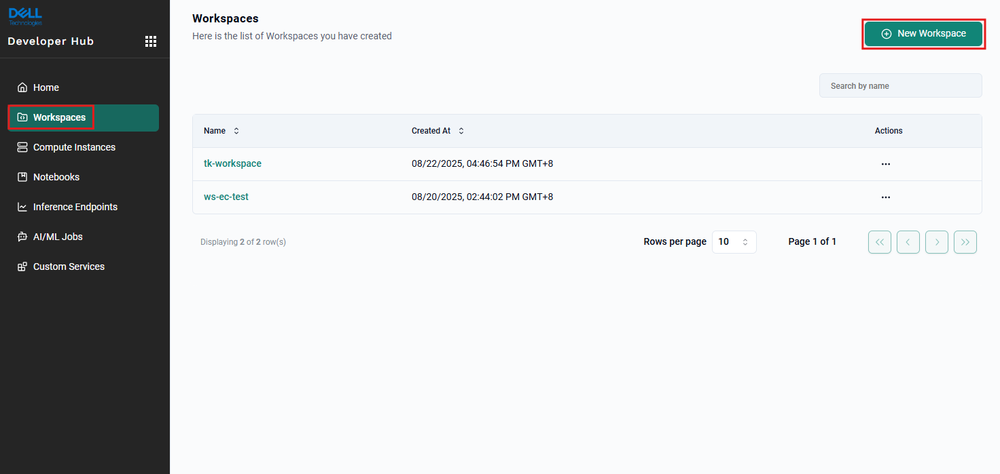   
4. Please consider to provide a unique name for your own workspace.  
   You may leave `Display Name` and `Description` empty.   
   Click on the `Save` button.  
   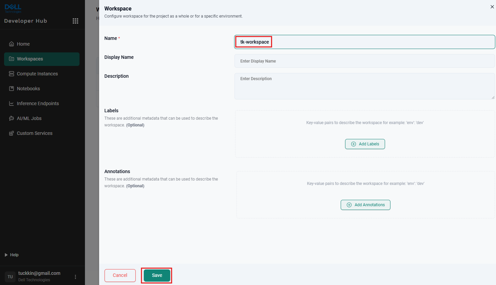   
5. Click the `Home` menu from the left panel.  
   On the right panel, there are multiple type of services which you can deploy in self-service manner.  
   (`Compute`, `Notebooks`, `Inference Endpoints`, `AI/ML Jobs`, `Custom Services`)   
6. Click the `New Compute Instance` button under the `Compute` Profiles.
   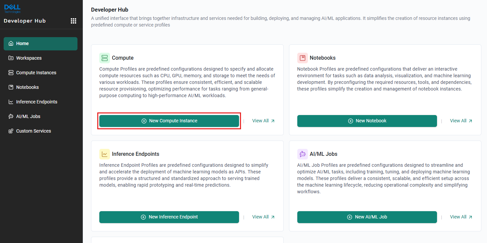   
7. `Lab 1 - vCluster` service template was created by infra administrator.  
   Let's create a new compute instance by clicking on `Select` button.
   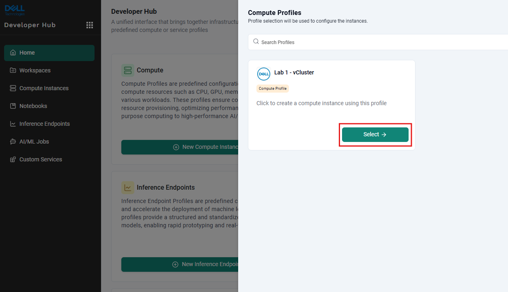   
8. Give your new vCluster instance a unique name.  
   Select your own created `Workspace`.  
   Click `Deploy` button.  
   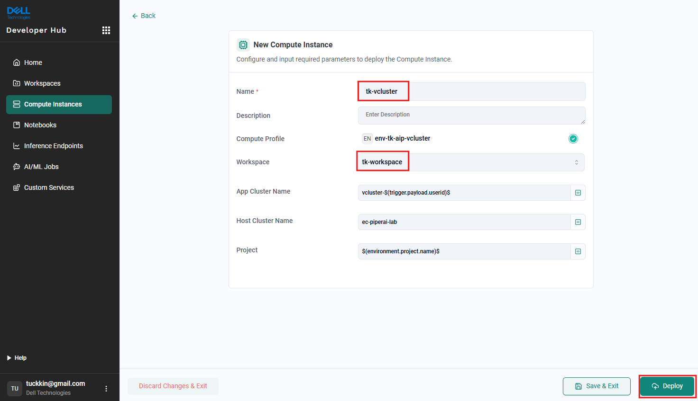   
9. The vCluster will start to be provisioned. It's progress can be monitored in `Status Tracker`.
   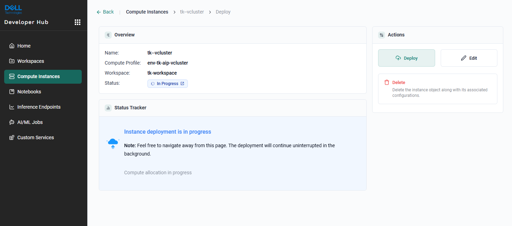   
10. Wait till the status turns to `Success` under the `Overview`.  
   You shall see the `vCluster` shown under the `Output`.  
   Try to note down value of the `vCluster` for the next steps.
   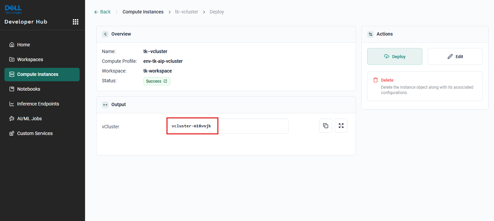   
11. Click on the nine dots button on the top left.  
   Navigate to `Infrastructure`.  
   Under  `engcheng-testing ` project on the right, click on `Go to Project` button.
      
12. Click on `My Clusters` menu option on the left.  
   Check the running status of the vcluster which you noted down in the previous step, wait until the `Status` shows `HEALTHY`.  
   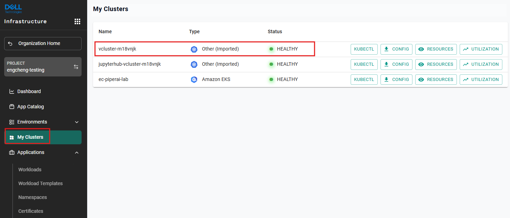   
13. Congratulatons! You have your own virtual kubernetes cluster deployed successfully!   

## Section 2 - Run a workload on the newly provisioned virtual kubernetes cluster
1. Back to your vCluster under the `My Clusters`, you will see 4 quick access buttons:
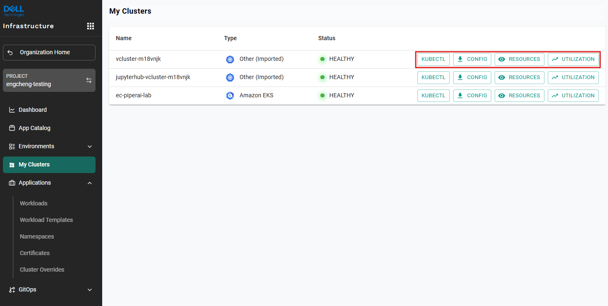
  - `KUBECTL` - for administrators to interact with the cluster through `kubectl` command
  - `RESOURCES` - to get a quick overview of the resources consumed by the cluster
  - `DASHBOARD` - multiple views of the cluster including general stats and cost related information.
  - `UTILIZATION` - a list of resources types, resource quotas (project and namespace limit) and the limit utilized by each resource operational on a given Kubernetes cluster.   
2. Click "KUBECTL" button in the same row of your vCluster where a console will be shown below.  
   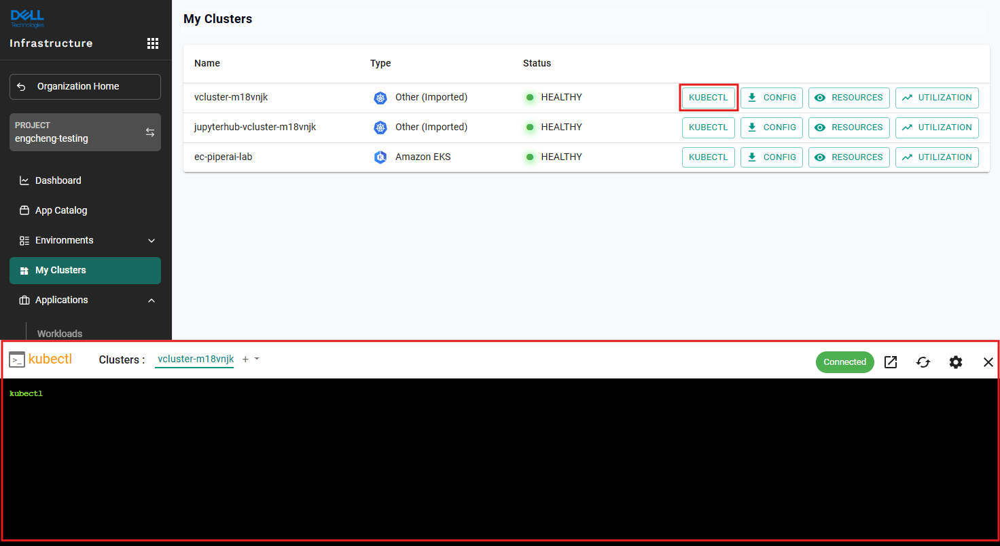
   The console provides a secure way to interact and issue commands to the cluster with `kubectl` as a prefix, barring other commands.   
3. Run the command: `kubectl run nginx --image=nginx`.  
   The return result `pod/nginx created` shows that pod was created.   
4. Run the command: `kubectl get pods`.  
   Make sure nginx pod is in `running` status.   
5. The pod is available only internally. Let's make it externally reachable through the command:  
   `kubectl expose pod/nginx --port=80 --name nginx --type=LoadBalancer`   
6. After a brief moment, we can check the result of exposing the service.  
   Enter the command: `kubectl get svc nginx`.
   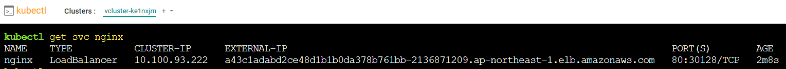   
7. The successful deployment will see under EXTERNAL-IP having value similar to:  
   `a43c1adabd2ce48d1b1b0da378b761bb-2136871209.ap-northeast-1.elb.amazonaws.com`   
8. Open a browser with the URL indicated. You will see `Welcome to nginx!`  
   (`Note`: The classic load balancer from AWS might take 15-20 seconds to be ready, if the first loading is not successful, please wait a while and try again)  
   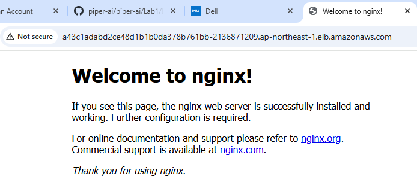   
9. Congratulation! You've completed deploying a workload on your newly deployed vcluster!
