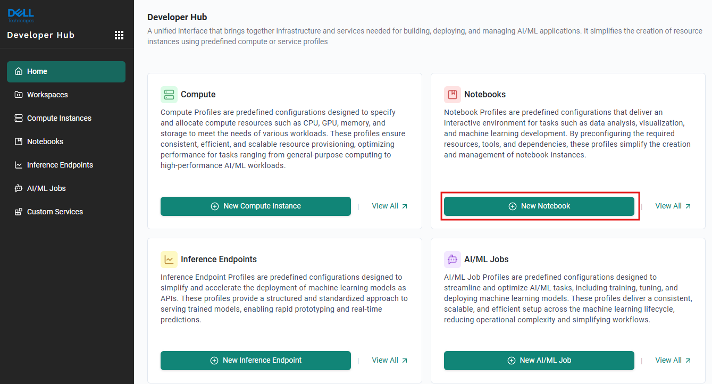
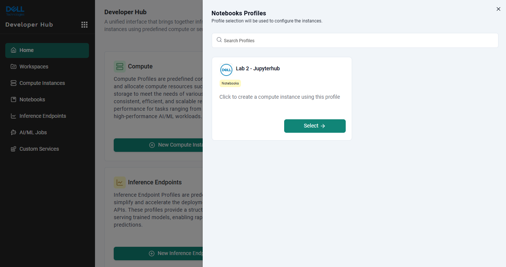
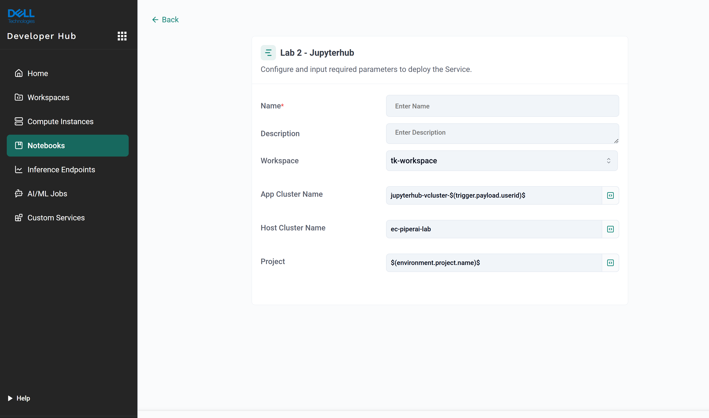
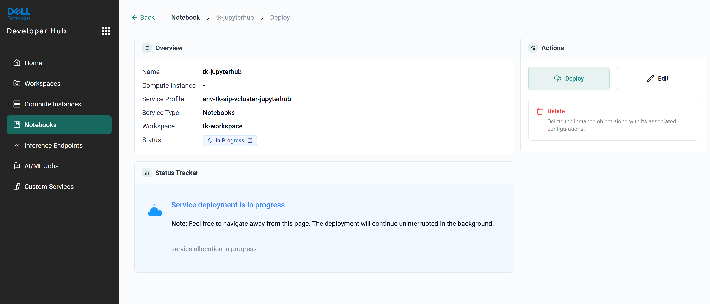
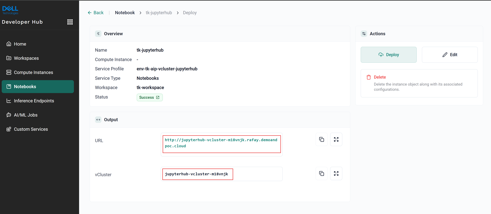
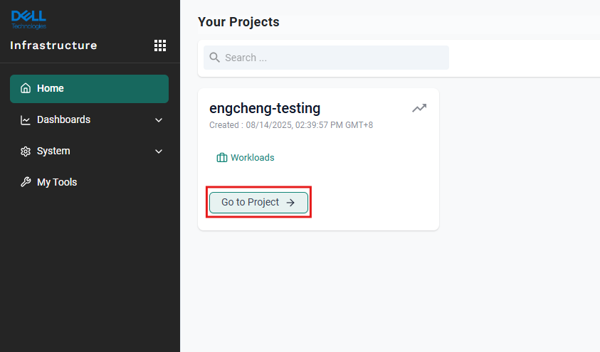
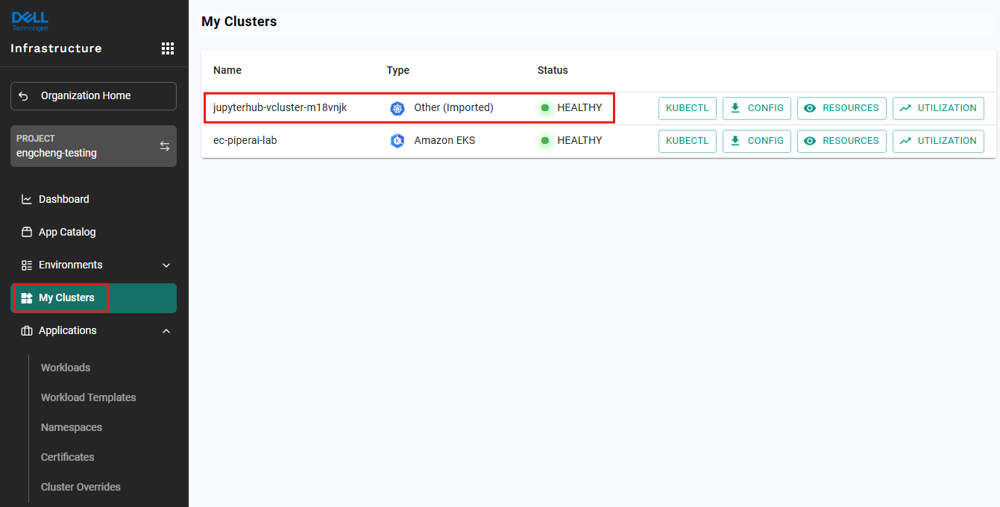
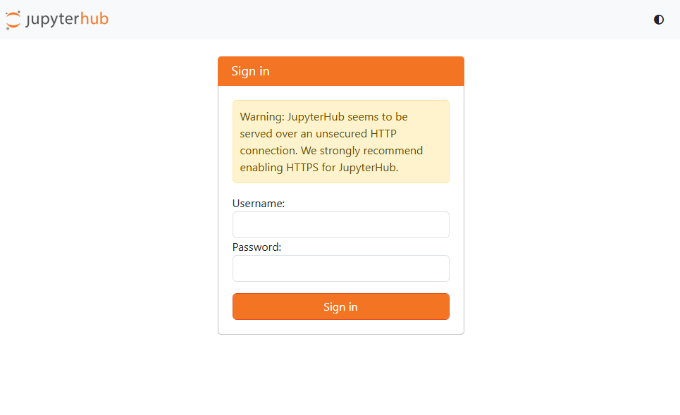
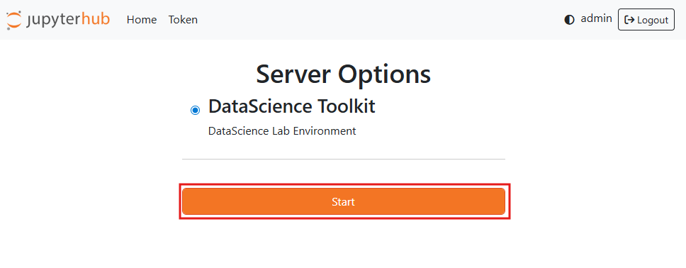
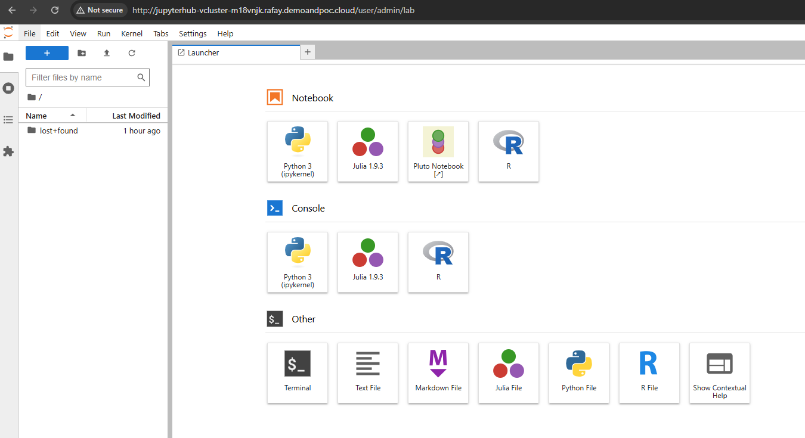

# Introduction
The purpose of lab 1 & 2 is to familiarize participants with basic functionality of Rafay console. 
This exercise ties together multiple concepts within Rafay to create a useable and tangible outcome.
The new understanding aims to encourage and trigger imagination of partipants to extend it with other serviecs.

# Lab 2 objectives
In this exercise, 
1. Participant will play the role of a Data Scientist / AI Developer.
2. Participant to use `Developer Hub` as the Rafay Self-Service Console to launch a new instance of Jupyterhub. 

# Sections
1. Create a new Jupyterhub instance through `Developer Hub` as the Rafay Self-Service Console.
2. Login to the newly provisioned Jupyerhub instance.

# Practice
## Create a new Jupyterhub instance
1. Log in to Dell's console at [https://dell.rafay.dev](https://dell.rafay.dev)
2. Click on the nine dots button on the top left  
   Navigate to `Developer Hub`
3. Over here, click the `New Notebook` button under the `Notebooks` Profiles

4. `Lab 2 - Jupyterhub` service template was created by infra administrator.  
   Let's create a new service instance by clicking on `Select` button

6. Give your new Jupyterhub instance a unique name and click `Deploy` button  
   (`Note`: Keep your workspace the same as in Lab 1)

7. The Jupyterhub will start to be provisioned. It's progress can be monitored in `Status Tracker`

8. Wait till the status turns to `Success` under the `Overview`.  
   You shall see the `URL` and `vCluster` shown under the `Output`.  
   Try to note down both the values for the next steps.

9. Click on the nine dots button on the top left  
   Navigate to `Infrastructure`
   Under  `engcheng-testing ` project on the right, click on `Go to Project` button

10. Click on `My Clusters` menu option on the left  
   Check the running status of the vcluster which you noted down in the previous step, wait until the `Status` shows `HEALTHY`  
   (`Note:` Your newly deployed JupyterHub is actually runing on a vCluster for security with isolation purpose.)

11. Congratulatons! You have your own Jupyterhub deployed successfully!

## Login to the newly provisioned JupyerHub instance
1. Open a new browser tab, paste the URL of the JupyterHub on the browser's address bar  
   You may key in any `Username` with EMPTY `Password`   

2. After login to the Jupyterhub, click the `Start` button to launch the JupyterLab  

3. Congratulation! You've completed deploying the JupyterLab from Jupyterhub.

