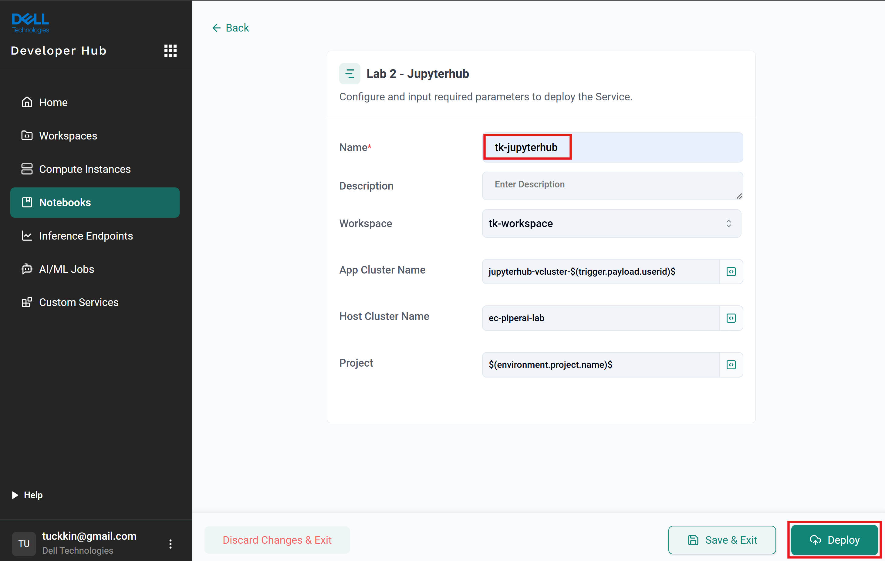

# Introduction
The purpose of lab 1 and lab 2 is to familarize participants with basic functionality of Rafay console. 
This exercise ties together multiple concepts within Rafay to create a useable and tangible outcome.
The new understanding aims to encourage and trigger imagination of partipants to extend it with other serviecs.

# Lab 2 objectives
In this exercise, 
1. Participant will play the role of a Data Scientist / AI Developer.
2. Participant to use Developer Hub as the Rafay Self-Service Console to launch a new instance of JupyterHub. 

# Sections
1. Create a new JupyterHub instance through Developer Hub as the Rafay Self-Service Console.
2. Login to the newly provisioned JupyerHub instance.

# Practice
## Create a new Jupyterhub instance
1. Log in to Dell's console at [https://dell.rafay.dev](https://dell.rafay.dev)
2. Click on the nine dots button on the top left  
   Navigate to `Developer Hub`
3. Over here, click the `New Notebook` button under the `Notebooks` Profiles

4. `Lab 2 - Jupyterhub` service was provisioned by administrator to us as a template. Let's create a new service instance by clicking on `Select` button

5. Give your new Jupyterhub instance a name and click `Deploy` button  
   (`Note`: Keep your workspace the same as in Lab 1)

6. The Jupyterhub will start to be provisioned. It's progress can be monitored in `Status Tracker`

7. Wait till the status turns to `Success` under the `Overview`.  
   You shall see the `URL` and `vCluster` shown under the `Output`.  
   Try to note down both the values for the next steps.

8. Click on the nine dots button on the top left  
   Navigate to `Infrastructure`
   Under  `engcheng-testing ` project on the right, click on `Go to Project` button

9. Click on `My Clusters` menu option on the left  
   Check the running status of the vcluster which you noted down in the previous step, wait until the `Status` shows `HEALTHY`  
   (`Note:` Your newly deployed JupyterHub is runing on a vCluster for security with isolation purpose.

## Login to the newly provisioned JupyerHub instance
1. Click on the nine dots button and select "Infrastructure"
2. Since the newly created cluster is hosted in "engcheng-testing" project, we will select "Go to project".

3. In the console shows "Infrastructure" -> "Clusters" and the newly created cluster is shown as well. 

4. On the top row, 3 quick access buttons available are:

  - "KUBECTL" - for administrators to interact with the cluster through `kubectl` command
  - "RESOURCES" - to get a quick overview of the resources consumed by the cluster
  - "DASHBOARD" - multiple views of the cluster including general stats and cost related information.

## Running workload on the cluster
1. Select "KUBECTL" where a console will be shown below.
2. The console provides a secure way to interact and issue commands to the cluster with "kubectl" as a prefix, barring other commands.
3. Run the command `kubectl run nginx --image=nginx`. The return result `pod/nginx created` shows that pod was created.
4. Using `kubectl get pods`, make sure nginx pod is in `running` status.
5. The pod is available only internally. Let's make it externally reachable through the command:
   `kubectl expose pod/nginx --port=80 --name nginx --type=LoadBalancer`
6. After a brief moment, we can check the result of exposing the service. Enter the command: `kubectl get svc nginx`.

7. The successful deployment will see under EXTERNAL-IP having value similar to `a43c1adabd2ce48d1b1b0da378b761bb-2136871209.ap-northeast-1.elb.amazonaws.com`
8. Open a browser with the URL indicated. You will see "Welcome to nginx!".

9. Congragulation! You've completed deploying a workload.
